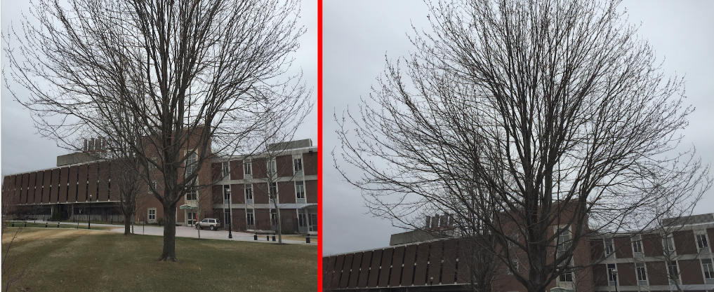
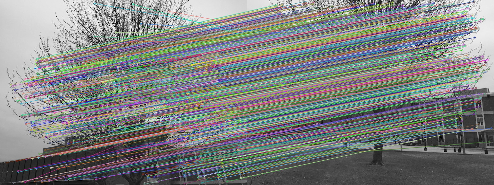
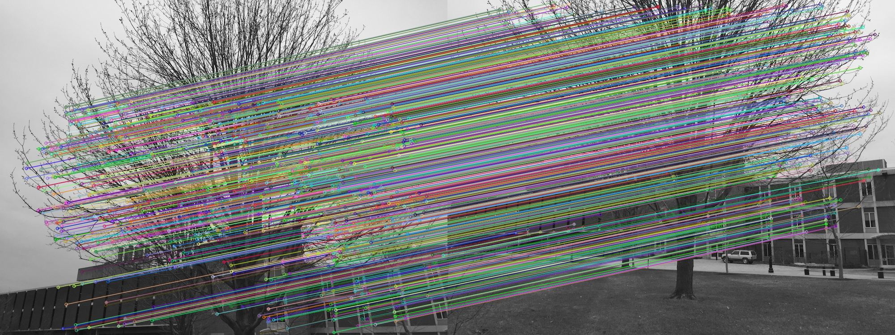
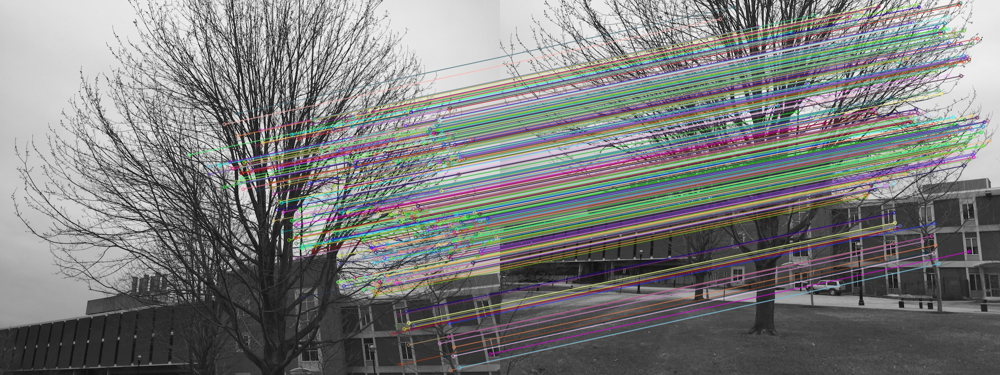
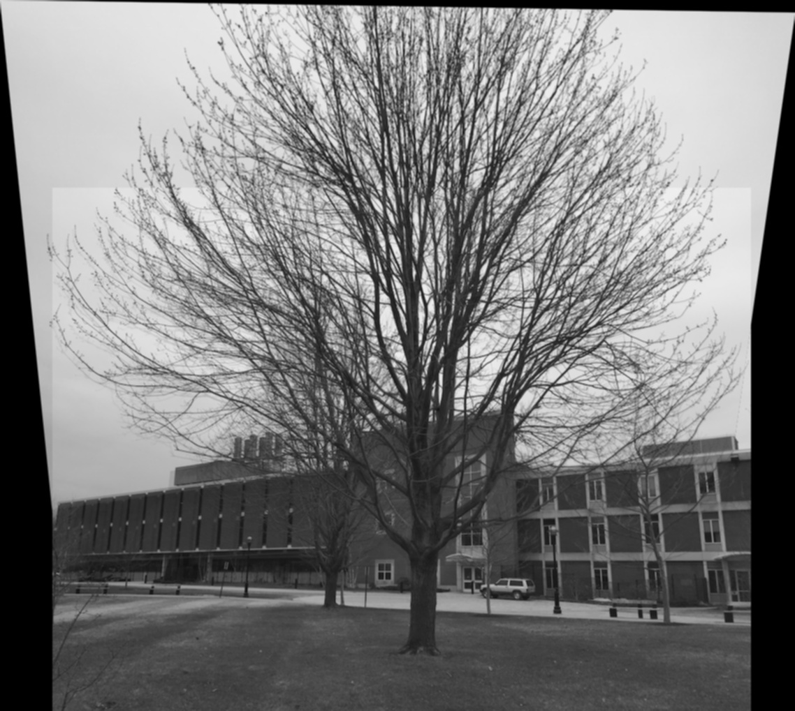

## Usage

``python stitch.py <img_dir>``

Script takes a folder of images as its input

## Example image

original images side by side



Here are the keypoints detected after the inital FLANN matching



Inlier keypoints after Fundamental matrix estimation



Remaining keypoints after homography estimation



Finally here are the two images stitched together along with the output log



## Output log

```
Comparing image2.JPG and image3.JPG
Matches found: 1287
Inliers count after Fundamental estimate: 966
Fundamental decision ---
Matched scene: inlier threshold meet
Inliers count after Homography estimate 397
Homography decision ---
image2_image3 Possible for alignment
Alignment possible: combine images
Warp Image 1 -> Image 2
```
